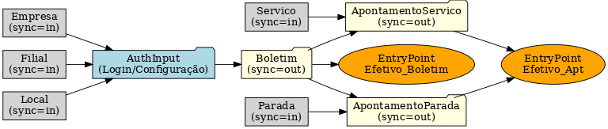

# Estrutura do Código Xmova (Exemplo de Apontamentos)

Este documento explica a estrutura das entidades definidas no código do Xmova, que servem para configurar telas, inputs, sincronização e comunicação com o NFS por meio de EntryPoints.

---

## 🔐 Auth / AuthInput

- **Auth** → Entidade de autenticação de funcionário:
  - `idEmpresa`, `idFilial`, `idLocal` → chaves de referência.
  - `seqFuncionario` → vínculo com o funcionário.

- **AuthInput** → Formulário usado no login/configuração inicial:
  - Campos como `descricaoEmpresa`, `descricaoFilial`, `descricaoLocal` são preenchidos automaticamente (`autoFill`).  
  - Alguns campos têm **validações online** (`onlineValidate=Valida_Cracha`).  
  - `fieldEvents` controlam lógica dinâmica, como filtrar filiais pela empresa selecionada.

---

## 📝 Boletim

- Entidade principal do fluxo, marcada como `sync=out` (ou seja, envia dados ao servidor).
- Campos importantes:
  - `dataInicial` e `locationInicial` → início do boletim.
  - `dataFinal` e `locationFinal` → finalização.
  - `codigoEquipamento` → identificação do equipamento.
- Possui listas **transientes**:
  - `apontamentoServico`
  - `apontamentoParada`
- Vinculado ao EntryPoint **Efetivo_Boletim** para sincronização.

---

## 🔧 Apontamentos

Representam registros de atividades dentro de um boletim:

- **ApontamentoServico** (`sync=out`):
  - Registra serviços realizados.  
  - Campos: `seqFuncionario`, `boletim`, `data`, `location`, `servico`.  
  - Sincronizado via EntryPoint **Efetivo_Apt**.

- **ApontamentoParada** (`sync=out`):
  - Registra paradas ocorridas.  
  - Campos semelhantes, mas vinculados a uma **Parada**.  
  - Também sincronizado em **Efetivo_Apt**.

---

## 📚 Tabelas de Apoio (sync=in)

- **Servico** e **Parada**  
  - Listas carregadas do servidor.  
  - Sincronização `beforeInstall|in`.  
  - Podem ser pesquisadas no app (por código ou descrição).

- **Empresa, Filial, Local**  
  - Usados na autenticação (`AuthInput`).  
  - Também carregados antes da instalação.  

- **SeqEquipamento, SeqFuncionario, TIPO_OPERACAO**  
  - Entidades auxiliares, geralmente chaves ou enums.

---

## ✨ Resumo do Fluxo

1. **Login/Configuração** → usuário escolhe empresa, filial, local e faz autenticação via `AuthInput`.
2. **Boletim** → abertura de um boletim com data/hora inicial, equipamento e localização.
3. **Apontamentos** → dentro do boletim podem ser adicionados serviços ou paradas.
4. **Finalização** → fechamento do boletim com `dataFinal` e `locationFinal`.
5. **Sincronização** → 
   - Dados enviados (`sync=out`): Boletim, ApontamentoServico, ApontamentoParada.  
   - Dados recebidos (`sync=in`): Empresa, Filial, Local, Servico, Parada.  
   - Comunicação feita pelos EntryPoints: **Efetivo_Boletim** e **Efetivo_Apt**.

---

## 📊 Fluxograma

Representação visual do fluxo entre Xmova e NFS:

📌 

